# ME6108-HWs

## Homework 1

There are two problems in HW1, one is to draw a line or a circle with
Bresenham algorithm, the other is to implement a required animation.

### Problem 1

I implemented the Bresenham algorithm in the `scanning_algorithm.py` file, 
with the standard serial scanning algorithm and the optimized 
parallel scanning algorithm for line, and the standard serial scanning 
algorithm for circle.

To test the correctness of the parallel algorithm, I wrote tests in 
`tests/test_algos.py` file, to compare the output of the optimized 
algorithm with the standard algorithm. There's also a test for comparing 
the performance of those two algorithms.

I didn't implement the optimized algorithm for scanning a circle.

> **ATTENTION**
> 
> I didn't implement the complete algorithm for supporting lines with all 
> kinds of slopes, especially for the slope less than 0. I just implemented 
> algorithms for lines with slopes greater than 1.

### Problem 2

I implemented the required animation in the `animation.py` file. I didn't 
write it in a very standard way, I just implemented the animation in a 
script file.

You can press any key to stop or continue the animation, but the **SPACE** 
key is recommended.

### Running

I only implement the terminal UI, so you just run the `main.py`, and input as the terminal prompted.
The demo is shown as following

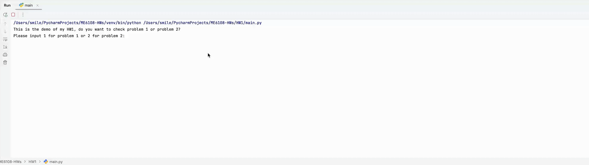

An example with starting point $(6, 6)$ and $(20, 10)$ is shown as following:

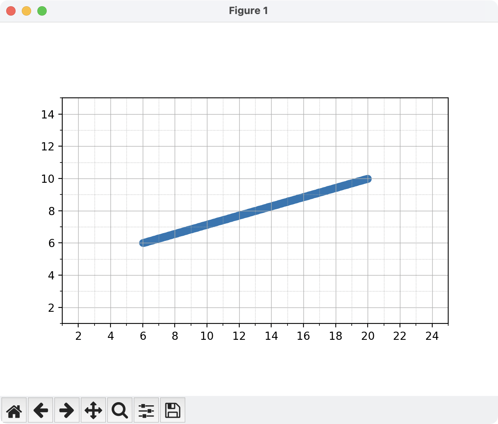

An example with center $(10, 10)$ and radius $5$ is shown as following:

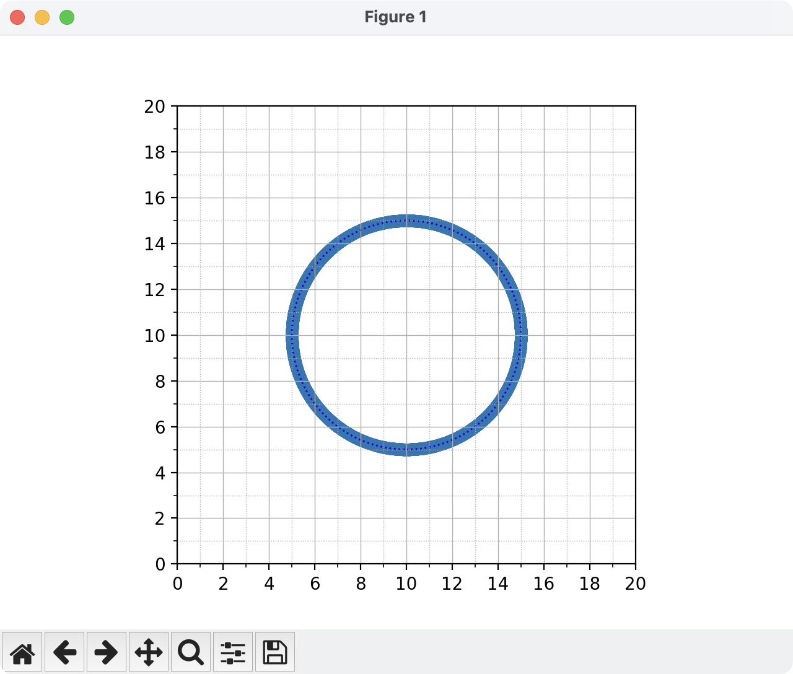

A recording for Problem 2 is shown as following:

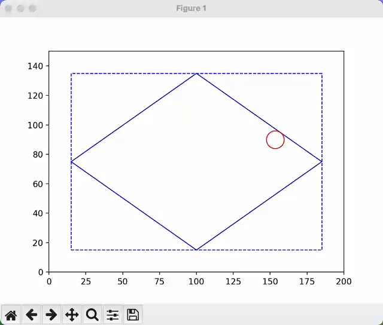

## Homework 2

Homework 2 requires to draw the Three View and the Isometric View of an object.
The coordinates of the vertex of the object are given in the `data*.
csv` file under the `HW2/data` directory.

Linear transformation algorithm is implemented in `HW2/trivs.py`, and the main 
script is in `HW2/main.py` for interacting with 
user input, and the `drawer.py` are for drawing the transformed figure.

The demo of user interface is shown as following:

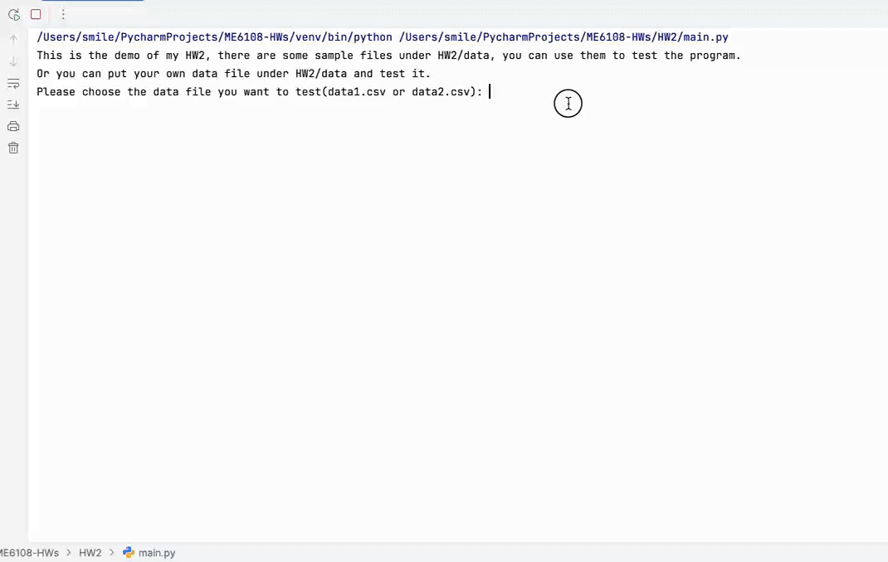

The Three View of the `data1.csv` is shown as following:

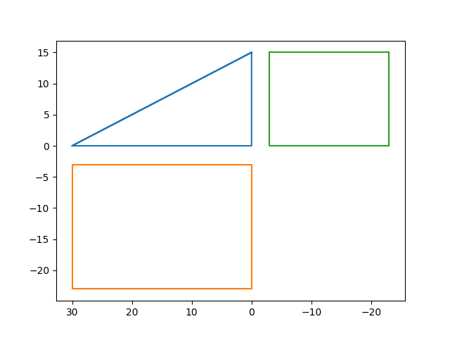

The Isometric View of the `data1.csv` is shown as following:

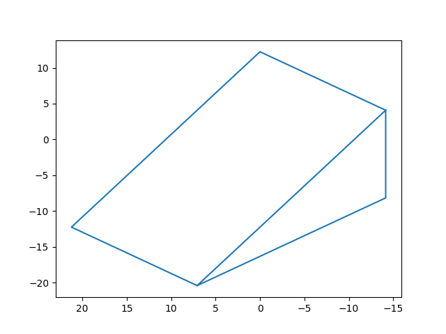

The Three View of the `data2.csv` is shown as following:

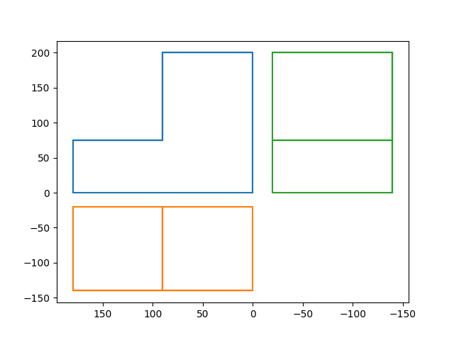

The Isometric View of the `data2.csv` is shown as following:

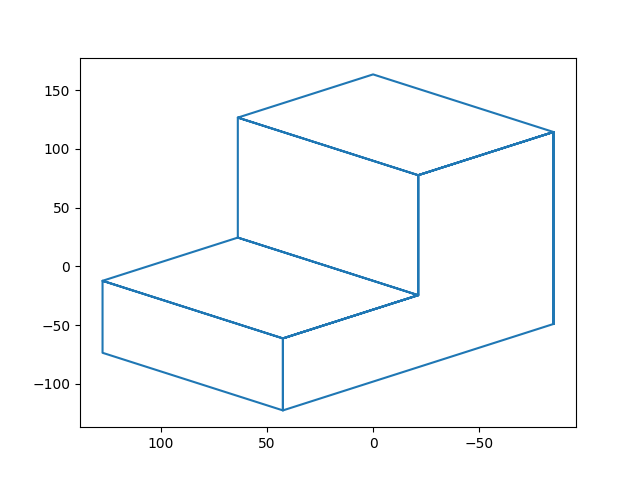

## Homework 3

HW3 requires to draw the Mandelbrot Set. I use python script to implement this.
First mesh the drawing region to a grid, and then calculate the Mandelbrot Set for each grid point.
You can change the parameters in the `HW3.py` file to draw different Mandelbrot Set.
The color based on the number of iterations within $\lvert z_n \rvert <= 2$, 
and I 
also write a function to normalize this 
number to RGB color value.

Some examples are shown as following:

# Homework 4

Homework 4 requires to show the process of creating Bezier curve with De Casteljau algorithm.
To increase the computation efficiency, I create a data structure for storing the intermediate points.

The data structure is a 4-dimensional numpy array, with the first dimension 
representing the timestamps, the second and third dimensions representing 
the 2D graph of the points generated by the recursion method, and the fourth 
dimension representing the coordinates of each point.

Then with matrix operation, I can compute the coordinates of all the 
timestamps at once, which is much faster than using the for loop to compute.

Some testing data is under the directory `HW4/data`, and the python script 
to run is `HW4/main.py`.

The demo of user interface is shown as following:

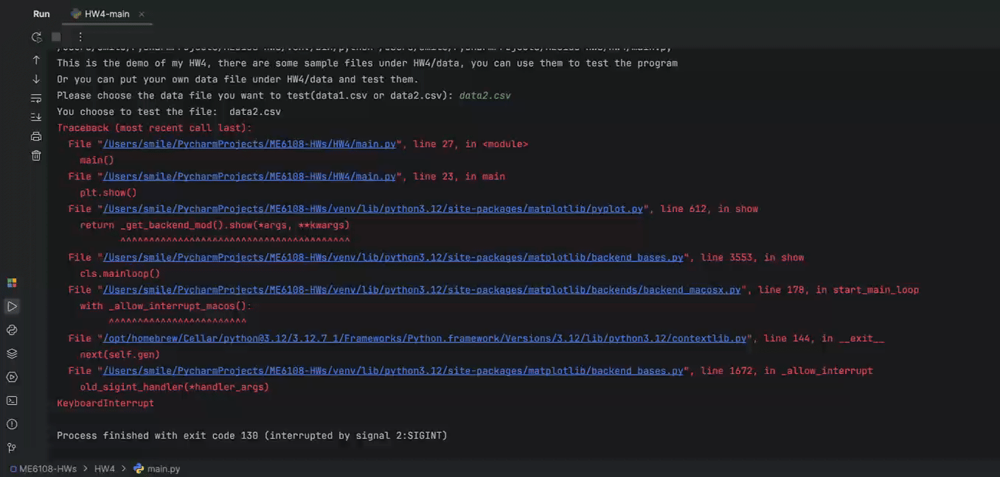

The process of creating Bezier curve with De Casteljau algorithm for `data1.csv` is shown as following:

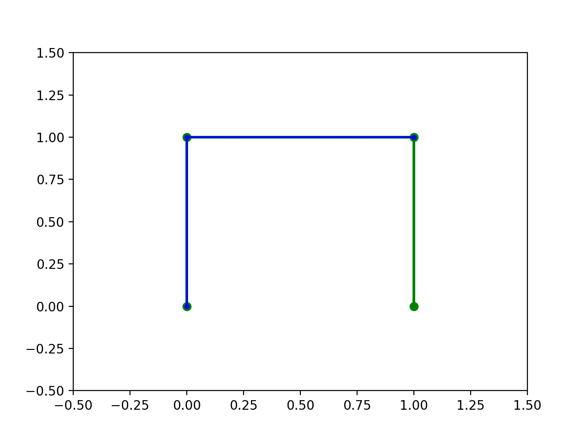

The process of creating Bezier curve with De Casteljau algorithm for `data2.csv` is shown as following:

The process of creating Bezier curve with De Casteljau algorithm for `data3.csv` is shown as following:

# Homework 5

Homework 5 requires to show the process of creating BSpline curve with De Boor algorithm.
To increase the computation efficiency, I create a data structure for storing the intermediate points.

The data structure is a 5-dimensional numpy array, the first dimension 
represents different sections of the BSpline curve, the second dimension
represents the timestamps in each section, the third and fourth dimensions
represent the 2D graph of the points generated by the recursion method, and the fifth
dimension represents the coordinates of each point.

Then with matrix operation, I can compute the coordinates of all the
timestamps at once for each section, which is much faster than using the for loop to compute.

Some testing data is under the directory `HW5/data`, and the python script
to run is `HW5/main.py`.

The demo of user interface is shown as following:

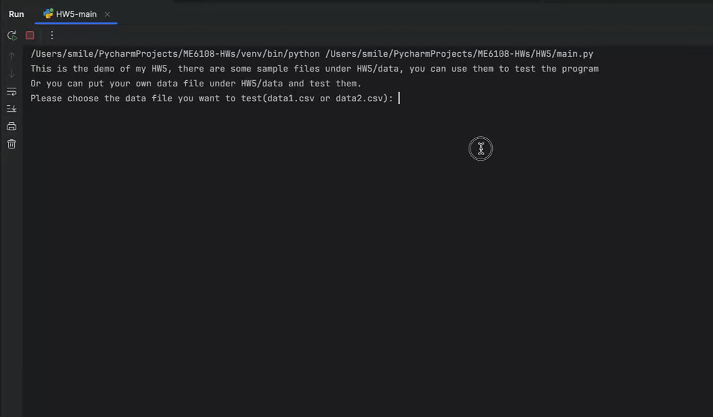

The process of creating BSpline curve with De Boor algorithm for `data1.csv` is shown as following:

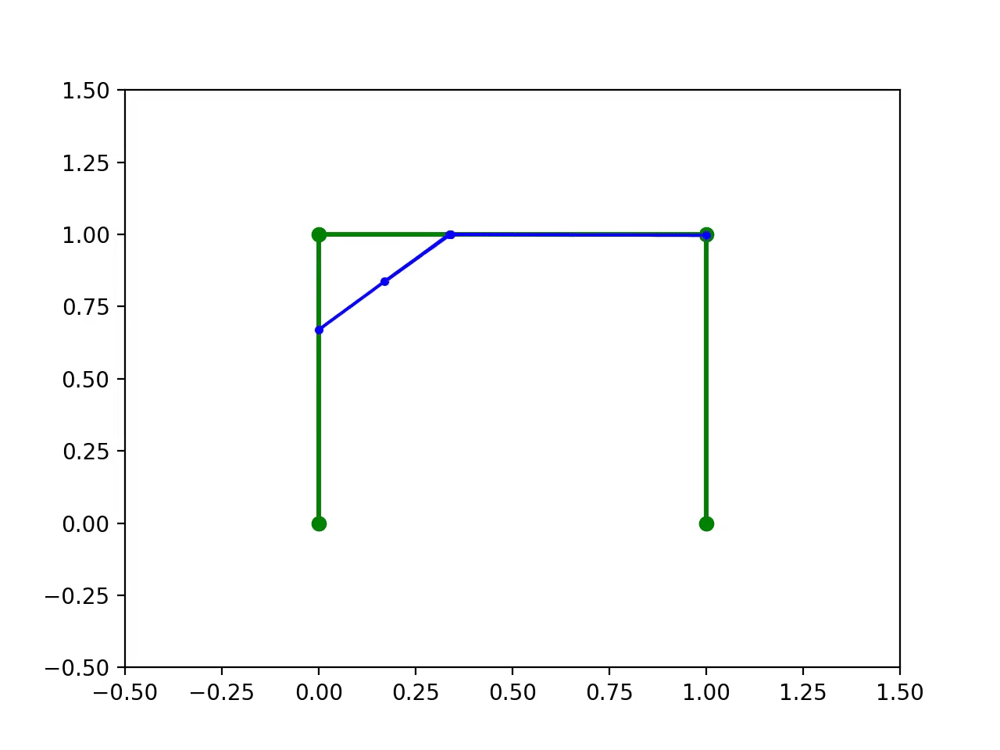

The process of creating BSpline curve with De Boor algorithm for `data2.csv` is shown as following:

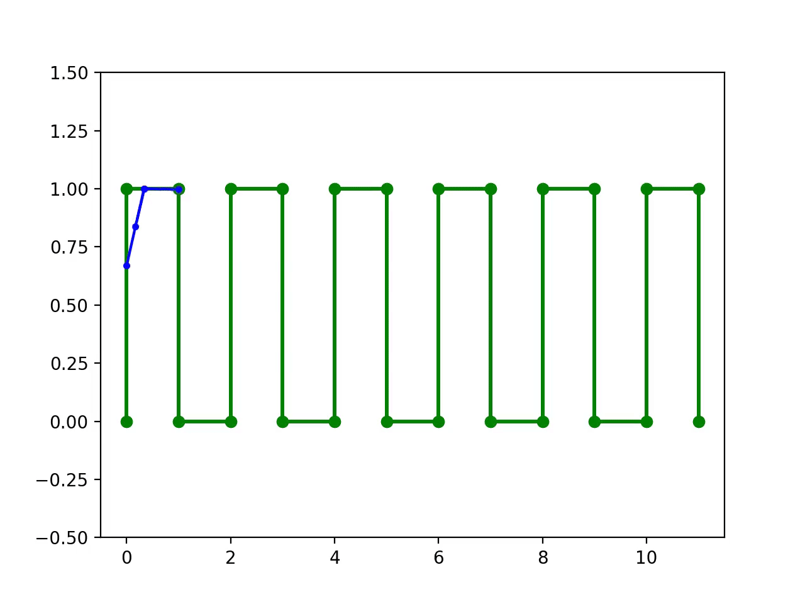

The process of creating BSpline curve with De Boor algorithm for `data3.csv` is shown as following:

